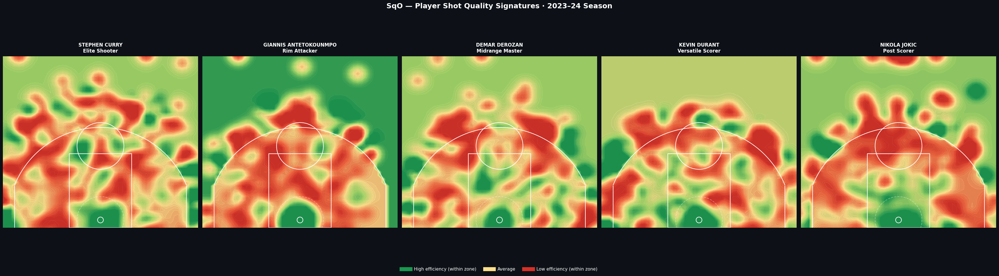
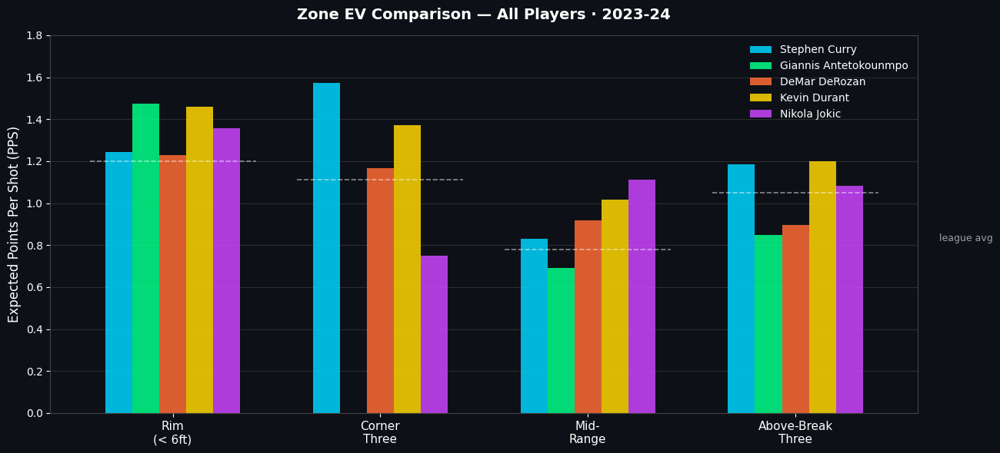
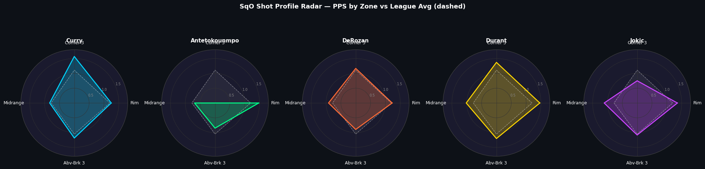

# SqO — NBA Shot Quality & Optimization

A spatial analytics tool that generates **personalized shot quality maps** 
for individual NBA players using Gaussian Kernel Density Estimation (KDE) 
on real shot chart data from the NBA Stats API.

> Built as a final project for an AI/ML course at the University of Connecticut.

## The Problem

League-average shot quality models treat all players the same. A corner three 
is worth ~1.11 PPS on average — but for Giannis Antetokounmpo in 2023-24, 
it was worth **0.00 PPS**. That difference is the entire point of this project.

## What It Does

- Pulls real shot chart data via `nba_api` (NBA Stats API)
- Builds a continuous **Points Per Shot (PPS) surface** using Gaussian KDE 
  with a Bayesian prior for sparse zones
- Generates player **shot quality heatmaps** normalized within each scoring zone
- Produces a **zone-level EV audit table** across 4 strategic zones
- Outputs a **defensive scouting report** with scheme recommendations

## Key Findings — 2023-24 Season

| Player | Rim EV | Corner 3 EV | Midrange EV | Above-Break 3 EV |
|---|---|---|---|---|
| Stephen Curry | 1.244 | **1.571** (+41% vs avg) | 0.830 | 1.183 |
| Giannis Antetokounmpo | **1.472** | **0.000** | 0.690 | 0.850 |
| DeMar DeRozan | 1.227 | 1.167 | **0.916** (+17% vs avg) | 0.894 |
| League Average | ~1.20 | ~1.11 | ~0.78 | ~1.05 |

## Shot Quality Signatures







## Methodology

**Why KDE over Neural Networks?**

The initial prototype used a TensorFlow MLP. It had two dealbreaker problems:
1. Training instability — different heatmaps every run due to random weight init
2. High variance in sparse zones with <10 shot attempts

Switching to Gaussian KDE with a Bayesian prior resolved both:
- Fully **deterministic** — same data = same output every run
- **Statistically principled** for 1,000–1,500 spatial point events
- Runs in **<60 seconds** on CPU, no GPU needed
- More **interpretable** to coaching stakeholders than a black-box model

**Bayesian Prior:** 5 pseudo-shots at league average FG% (0.46) anchors 
estimates in sparse zones without distorting data-rich zones.

**Within-Zone Normalization:** Color is scaled independently inside and 
outside the arc, revealing subtle efficiency gradients hidden by the 
2pt vs 3pt value difference.

## Tech Stack
Python · nba_api · NumPy · SciPy · Pandas · Matplotlib

## Setup

```bash
pip install nba_api scipy matplotlib numpy pandas
```

Then run `SQO.ipynb` in Google Colab or Jupyter.

## Players Covered

The notebook runs on 5 players by default:
- Stephen Curry (Elite Shooter)
- Giannis Antetokounmpo (Rim Attacker)
- DeMar DeRozan (Midrange Master)
- Kevin Durant (Versatile Scorer)
- Nikola Jokic (Post Scorer)

To add any player, find their NBA Stats ID and add to the `PLAYERS` list.

## Roadmap

- [ ] Defender proximity conditioning (open vs contested surfaces)
- [ ] Game-state context (shot clock, score differential, fatigue)
- [ ] Opponent scouting module (defensive vulnerability maps)
- [ ] Real-time REST API deployment

## Research Paper

Full write-up in `/paper/SQO_Paper.pdf` covering methodology, 
related work (Goldsberry 2012, Cervone et al. 2014), and findings.

## References

1. Goldsberry, K. (2012). CourtVision. MIT Sloan Sports Analytics Conference.
2. Cervone et al. (2014). POINTWISE. MIT Sloan Sports Analytics Conference.
3. Franks et al. (2015). Counterpoints. MIT Sloan Sports Analytics Conference.
4. Diggle, P.J. (2013). Statistical Analysis of Spatial Point Patterns. CRC Press.
5. [nba_api](https://github.com/swar/nba_api)
